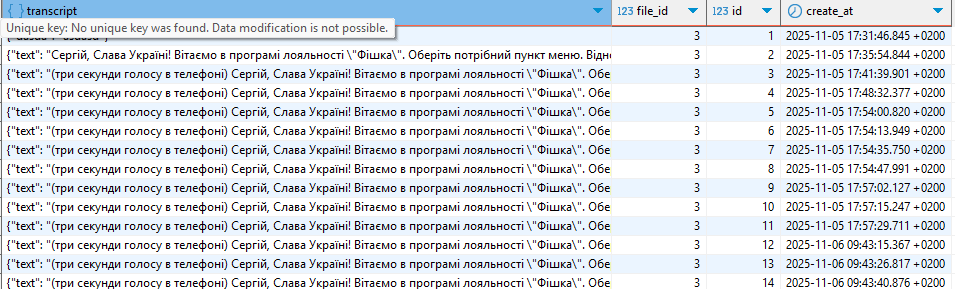

1. In array **call_id_array** add list of files ids
2. Create .env and add
* ELEVENLABS_API_KEY=
*    WEBITEL_APi_KEY=
*    BD_USER=
*    BD_HOST=
*    BD_DATABASE=
*    BD_PASSWORD=
*    BD_PORT=

In your PG DataBase you need to create table and schema:
`CREATE TABLE okko.transcript_call (
transcript jsonb NULL,
file_id int4 NULL,
id bigserial NOT NULL,
create_at timestamptz DEFAULT now() NULL
);`

run npm install
run npm run

